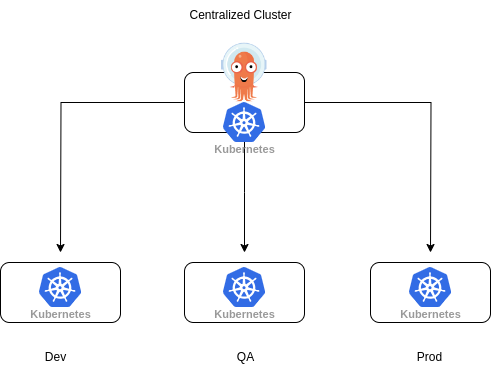

# Considerations for a centralized ArgoCD setup using OpenShift GitOps
A hub and spoke setup of ArgoCD means having one or more ArgoCD instances running in a centralized location, e.g. a management or service cluster and use this instance for deployment in other clusters.



In a setup that only allows for unidirectional traffic, we can configure the ArgoCD instance to allow for deploying directly to the remote clusters. In order to do this we need to give it access to the other clusters. This is done by adding a secret with the required data and label for ArgoCD to pick it up. The [documentation outlines the process](https://argo-cd.readthedocs.io/en/stable/operator-manual/declarative-setup/#clusters) for this.

ArgoCD comes with its own RBAC which should be configured appropiately based on the needs of the organization and the teams. On top of this we also need to configure the RBAC for the application controller, as this is the component that will be doing the actual deployment of resources. For this we will want to restrict the permissions to only include the required resources.

## ArgoCD RBAC
The [RBAC for ArgoCD](https://argo-cd.readthedocs.io/en/stable/operator-manual/rbac/#rbac-configuration) should map to the requirements of the team and organization. Commonly the focus will be about mapping teams and the ArgoCD Projects they can use for their deployments.

## Application Controller RBAC

Here is an example of how to only allow certain resources to be managed by the application controller. This needs to exist on all the remote clusters and bound to a service account ArgoCD can use.

### ClusterRole
```yaml
apiVersion: rbac.authorization.k8s.io/v1
kind: ClusterRole
metadata:
  name: limited-argo-role
rules:

- apiGroups:
  - ""
  resources:
  - "pods"
  verbs:
  - "*"
- apiGroups:
  - ""
  resources:
  - "configmaps"
  verbs:
  - "*"
- apiGroups:
  - ""
  resources:
  - "persistentvolumeclaims"
  verbs:
  - "*"
- apiGroups:
  - ""
  resources:
  - "services"
  verbs:
  - "*"
- apiGroups:
  - ""
  resources:
  - "serviceaccounts"
  verbs:
  - "*"
- apiGroups:
  - "route.openshift.io"
  resources:
  - "routes"
  verbs:
  - "*"
- apiGroups:
  - "route.openshift.io"
  resources:
  - "routes/custom-host"
  verbs:
  - "*"
- apiGroups:
  - "apps"
  resources:
  - "deployments"
  verbs:
  - "*"
- apiGroups:
  - "bitnami.com"
  resources:
  - "sealedsecrets"
  verbs:
  - "*"
- apiGroups:
  - "argoproj.io"
  resources:
  - "applications"
  verbs:
  - "*"
- apiGroups:
  - "batch"
  resources:
  - "jobs"
  verbs:
  - "*"
- apiGroups:
  - "batch"
  resources:
  - "cronjobs"
  verbs:
  - "*"
```
The actual requirements will depend on the organization and teams working with it.

## AppProjects
The AppProject is a resource that we deploy our **Applications** to. Which AppProject that we can use will depend on the configured RBAC inside of ArgoCD and the configuration of the AppProject will determine what we can deploy and where.

### AppProject
```yaml
spec:
  destinations: # 1
  - namespace: '*'
    server: '*'
  sourceRepos: # 2
  - '*'
  clusterResourceWhitelist: # 3
  - group: '*'
    kind: '*'
  roles: # 4
    - name: admins
```
1. Where can the ArgoCD [Applications](https://argo-cd.readthedocs.io/en/stable/operator-manual/declarative-setup/#applications) be deployed?
2. List of Git repositories that this project will monitor for application configurations.
3. What resources can be deployed in this [Project](https://argo-cd.readthedocs.io/en/stable/user-guide/projects/#projects)
4. Who are allowed to deploy


## AppofApp or ApplicationSets
Currently the two most widely deployment methods are [ApplicationSets](https://argo-cd.readthedocs.io/en/stable/user-guide/application-set/) and the [AppofApp](https://argo-cd.readthedocs.io/en/stable/operator-manual/cluster-bootstrapping/#app-of-apps-pattern) pattern.

### AppofApps
The AppofApps pattern has been around longer and is more well known. In short, it is a way of deploying and managing multiple applications within a cluster. The pattern relies on having a meta-application or "App of Apps" that defines and manages the deployment of other applications.

#### AppofApp example
```yaml
---
apiVersion: argoproj.io/v1alpha1
kind: Application
metadata:
  name: appofapp
  namespace: openshift-gitops
spec:
  destination:
    namespace: openshift-gitops
    server: https://kubernetes.default.svc
  project: team-1
  source:
    path: 'applications/team-one/'
    repoURL: git@github.com/deployments.git
    targetRevision: main
  syncPolicy:
    automated:
      prune: false
      selfHeal: true
```
If and when using this for application deployments, it is necessary to ensure that **Applications** are not deployed in the same namespace as a ArgoCD instance, as it can be used to make changes to ArgoCD itself.

### ApplicationSets
ApplicationSets allows you to define and manage multiple applications using a templated approach. It enables you to scale your application deployments by dynamically generating configurations based on templates and a set of parameters.

It also allows for deployment to multiple clusters directly.

#### ApplicationSet example
```
apiVersion: argoproj.io/v1alpha1
kind: ApplicationSet
metadata:
  name: guestbook
spec:
  generators:
  - list:
      elements:
      - cluster: engineering-dev
        url: https://1.2.3.4
      - cluster: engineering-prod
        url: https://2.4.6.8
      - cluster: finance-preprod
        url: https://9.8.7.6
  template:
    metadata:
      name: '{{cluster}}-guestbook'
    spec:
      project: default
      source:
        repoURL: https://github.com/argoproj/argo-cd.git
        targetRevision: HEAD
        path: applicationset/examples/list-generator/guestbook/{{cluster}}
      destination:
        server: '{{url}}'
        namespace: guestbook
```

## Sharding considerations

## Further Reading
I would recommend looking into this blog post [ArgoCD Multi-Tenancy Strategy](https://medium.com/@geoffrey.muselli/argocd-multi-tenancy-strategy-94d72183c94) for a deeper dive into how to work with ArgoCD.